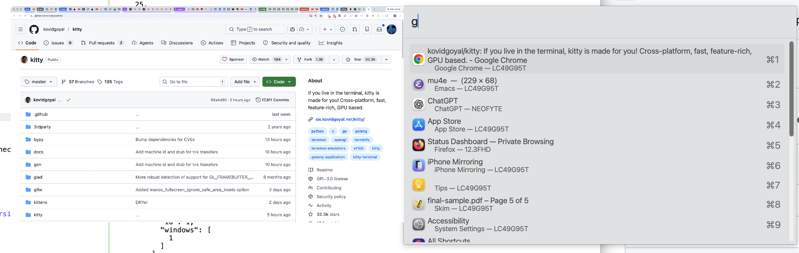

#+OPTIONS: ^:nil

* hs_select_window

A Hammerspoon spoon for fast window switching with incremental search and live thumbnail previews.

** Features

- Jump to any window by typing part of its title or application name
- Windows listed in most-recently-used order
- Incremental search across window title and application name
- Live thumbnail preview of the selected window
- On wide screens (>3000px), the chooser narrows automatically for a cleaner layout

** Installation

Clone this repository into your Hammerspoon Spoons directory:

#+begin_src bash
cd ~/.hammerspoon/Spoons
git clone https://github.com/dmgerman/hs_select_window.spoon.git
#+end_src

Then add to your =~/.hammerspoon/init.lua=:

#+begin_src lua
hs.loadSpoon("hs_select_window")

local SWbindings = {
   all_windows                          = { {"alt"}, "b"},
   app_windows                          = { {"alt", "shift"}, "b"},
   all_windows_move_to_current_workspace = { {"alt", "ctrl"}, "b"},
   first_window_per_app                 = { {"alt", "cmd"}, "b"}
}
spoon.hs_select_window:bindHotkeys(SWbindings)
#+end_src

** Hotkey bindings

| Binding       | Action                                       |
|---------------+----------------------------------------------|
| =all_windows= | Show all windows                             |
| =app_windows= | Show windows of the current application only |
| =all_windows_move_to_current_workspace= | Select a window and move it to the current workspace |
| =first_window_per_app= | Show only the first (most recent) window per application |

** Keyboard shortcuts while the chooser is open

| Key             | Action                                 |
|-----------------+----------------------------------------|
| =Tab=           | Toggle thumbnail preview on/off        |
| =Shift+Tab=     | Force refresh the current thumbnail    |
| hotkey          | Move to next item (same as Ctrl+n)     |
| Shift+hotkey    | Move to previous item (same as Ctrl+p) |

** Configuration

Set these properties after loading the spoon to customize behavior:

#+begin_src lua
-- Number of rows shown in the chooser (default: 14)
spoon.hs_select_window.rowsToDisplay = 14

-- Font size for chooser text (nil = system default)
spoon.hs_select_window.fontSize = nil

-- Show thumbnail of selected window (nil = off, toggle with Tab)
spoon.hs_select_window.showCurrentlySelectedWindow = nil

-- How often the thumbnail updates, in seconds (default: 0.2)
spoon.hs_select_window.displayDelay = 0.2

-- Height of thumbnail as a ratio of screen height (default: 0.4)
spoon.hs_select_window.overlayHeightRatio = 0.4

-- Keep thumbnail cache between chooser invocations (default: false)
-- When true, thumbnails load faster but may show stale content.
-- Use Shift+Tab to force refresh.
spoon.hs_select_window.persistentThumbnailCache = false
#+end_src
